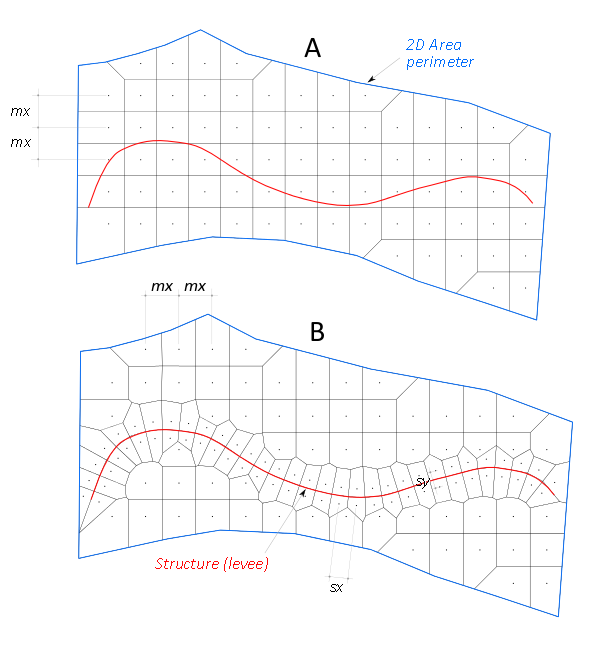
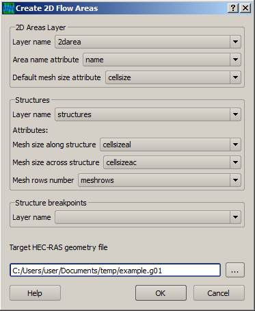

:Publish Date: 2015-02-03

.. _create_2d_area:

Create 2D Areas
---------------------------
Menu: 2D Geometry

.. _fig_mesh_with_structure:

   
   2D Area with (A) regular mesh and (B) structure aligned mesh.
   
Creates 2D areas and adds them to specified HEC-RAS geometry file (\*.g\*\*). The mesh can be locally aligned to structure lines (see :ref:`2d Area B <fig_mesh_with_structure>`).

HEC-RAS built-in mesher creates regular quadratic mesh inside 2D areas. If you need need such regular grid, pick a polygon layer with 2d areas shapes, choose name and cell size attributes and run the tool. 

Sometimes, however, it is necessary to have cell faces aligned with a structure and doing it manually could be a challenge. Then you specify polyline layer with structures that the mesh should be aligned to. Cell size across a structure will usually be somewhat smaller than the mesh size along the structure and that of the surrounding regular grid. Be careful, as too small values will result in cells with more than 8 faces, which is forbidden in current HEC-RAS version.
You can also specify a number of mesh rows that should be aligned to particular structure line.

When you need cell faces on a structure at an irregular spacing, you can put breakpoints on that structure.

.. _fig_create2dareas_dialog:

   
   Create 2D Area dialog window. 

^^^^^^^^^^^^^^^^
Tool parameters
^^^^^^^^^^^^^^^^

* :dfn:`2D Areas Layer Name` --- polygon layer of 2D mesh areas. You can have any number of polygons, but multigeometry (i.e. multipolygon) is not allowed.
* :dfn:`2D Areas Name Attribute` --- attribute with 2d area name. 
* :dfn:`2D Areas Default Mesh Size Attribute` --- attribute with regular mesh points spacing for a given 2D area. Spacing is depicted as :dfn:`mx` on figure :ref:`2d mesh <fig_mesh_with_structure>`.
* :dfn:`Structures Layer Name` --- polyline layer of structures that need aligned mesh points. You can have many structure lines. Simple geometry is required.
* :dfn:`Mesh Size Along Structure Attribute` --- attribute with mesh size along a structure (*sx* on :ref:`2d Area B <fig_mesh_with_structure>`).
* :dfn:`Mesh Size Across Structure Attribute` --- attribute with mesh size across a structure (*sy* on :ref:`2d Area B <fig_mesh_with_structure>`).
* :dfn:`Structures Mesh Rows Attribute` --- attribute with number of mesh rows aligned to the structure.
* :dfn:`Structure breakpoints layer name` --- point layer name with points where you expect a cell face: mesh points will be created on both sides of each breakpoint, see below.

.. _fig_2dmesh_2rows_1row:
.. figure:: img/fig_2dmesh_2rows_1row.jpg
   :align: center
   
   Structure aligned mesh --- illustration for number of mesh rows to be aligned and breakpoints (orange points).
   
Here we would like the mesh to be aligned to the channel (left) and levee (right). Because there are groins in the channel we place the breakpoints on the curvy channel structure line. Breakpoints do not have to be snapped to the structure line or to have any special attributes, as we only want to break the structure at that point. Mesh points are placed around a breakpoint at a distance :dfn:`d = (minimal breakpoints spacing for the entire structure) / 4`. Then remaining gaps are filled with additional mesh points at spacing not smaller than :dfn:`d`.

  

