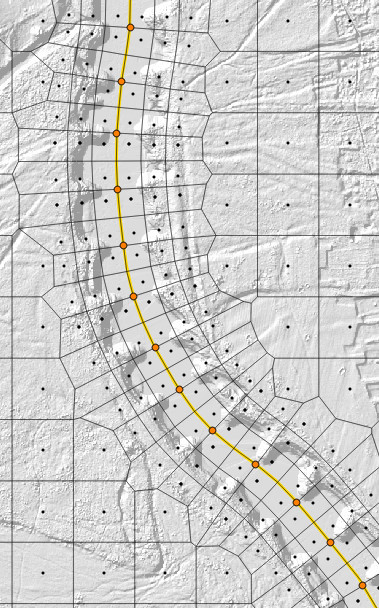

Welcome to RiverGIS!
====================================

RiverGIS is a `QGIS plugin <http://qgis.org/>`_ that helps you create HEC-RAS flow model and process its results. It is under active development and in *pre-alpha* stage. Currently *only 2D models* are supported. 

RiverGIS is `free/libre software <https://www.gnu.org/philosophy/free-sw.en.html>`_ and is released under the `GNU General Public License <http://www.gnu.org/copyleft/gpl.html>`_. Browse the `source code on github <https://github.com/erpas/rivergis>`_.
   
Table of contents:

.. toctree::
   :maxdepth: 2
   
   install_req
   stepByStep1d
   stepByStep2d
   create2darea
   loadWselFromHdf
   createWSELRaster
   api

-------------------
Current features
-------------------

* :ref:`create_2d_area` and add it to specified HEC-RAS geometry file (\*.g\*\*)
* :ref:`load_wsel_from_hdf` (HEC-RAS results file)
* :ref:`create_wsel_raster`  

-------------
Requirements
-------------

For some operations RiverGIS needs an active connection to a PostGIS database. You can create a new connection from QGIS menu :menuselection:`Layer --> Add layer --> Add PostGIS layers...`.

Loading HEC-RAS 2D results requires a :program:`h5py` Python package ( http://www.h5py.org ). See :ref:`install_req`.

Import 1D river data from ISOKP system requires a :program:`MySQLdb` Python package.

Some raster operations use :program:`SAGA` and :program:`GRASS7` processing modules. Check if they are setup properly :menuselection:`Processing --> Options --> Providers`.

-------------
What's new
-------------
2015.04.26, ver. 0.18

* added universal HEC-RAS result loader from HDF (2D results functioning for now)

2015.03.16, ver. 0.16

* import of 1D data from ISOKP system into a PostGIS database
* depth raster and flood range vector creation
* removed GRASS7 processing module dependency for water surface raster creation
* toolbar added

2015.02.05, ver. 0.15.1
* a new tutorial: :ref:`stepbystep2d`

