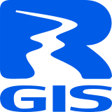
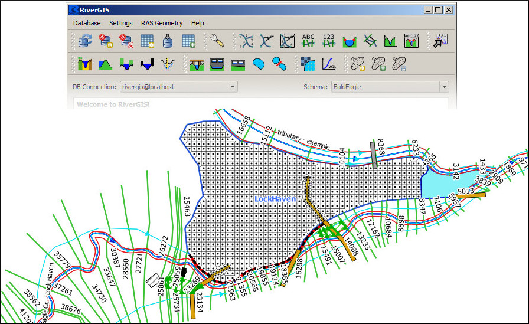

Welcome to RiverGIS!
====================

RiverGIS is a `QGIS plugin <http://qgis.org/>`_ for creating HEC-RAS flow model geometry from spatial data. The functionality is similar to that of `HEC-GeoRAS <http://www.hec.usace.army.mil/software/hec-georas/>`_. For data store and spatial operations it needs a `PostGIS <http://postgis.net>`_ database.

RiverGIS is `free/libre software <https://www.gnu.org/philosophy/free-sw.en.html>`_ and is released under the `GNU General Public License <http://www.gnu.org/copyleft/gpl.html>`_. Browse the `source code on github <https://github.com/erpas/rgis>`_.

Table of contents:

.. toctree::
   :maxdepth: 2
   
   q2a
   requirements
   ras1d_geometry
   ras2d_geometry
   settings
   about

