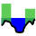
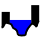
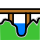

.. _stepbystep1d:

=================================
Step by step: HEC-RAS 1D Geometry
=================================

This manual presents using the RiverGIS plugin for creation of HEC-RAS 1D flow model.

RiverGIS tries to mimic the workflow of HEC-GeoRAS where it is possible and users are encouraged to read the `HEC-GeoRAS documentation`_.

  .. _HEC-GeoRAS documentation: http://rivergis.com/GeoRAS_docs/HEC_GeoRAS_10_for_ArcGIS_10.pdf

As an example, a modified *Bald Eagle* project data from *HEC-RAS Unsteady Examples* are used. The project source data can be downloaded from `rivergis.com <http://rivergis.com/download/baldeagle.zip>`_. The archive contains also QGIS project file with all the data and projection defined (NAD 1983 StatePlane Pennsylvania North FIPS 3701 Feet). Unzip the archive and open ``BaldEagle.qgs`` project file.

.. figure:: img/ras1d_bald_start.png
   :align: center

-------------------------
Typical RiverGIS workflow
-------------------------

#. :ref:`Create a new database schema for a model<ras1d_create_schema>`
#. :ref:`Set model's spatial projection <ras1d_projection>`
#. :ref:`Create/import geometry <ras1d_geometry_creation>` of the model (river lines, cross-sections, hydraulic structures)
#. :ref:`Build rivers network <ras1d_network>` (topology, i.e. reach connectivity and order, reach lengths)
#. :ref:`Calculate cross-sections' attributes <ras1d_xsections>` (stations, downstream lengths, etc.) and vertical shape (probe a DTM raster)
#. :ref:`Find Manning's roughness coefficients <ras1d_manning>` for cross-sections
#. :ref:`Define additional cross-sections' data <ras1d_xs_additional>` (levees, ineffecive flow areas and obstructions)
#. :ref:`Build hydraulic structures <ras1_structures>` (bridges/culverts, inline and lateral structures, storage areas, etc.).
#. :ref:`Create HEC-RAS GIS Import file <ras1d_sdf>` (*.sdf)

.. _ras1d_create_schema:

----------------------
Create database schema
----------------------

A fundamental difference from HEC-GeoRAS is that the RiverGIS uses a ``PostgreSQL`` database with ``PostGIS`` spatial extension for data storage (see :ref:`requirements` for installation instructions). A term *river database* refers to a database used by RiverGIS. Until a database and schema are set in RiverGIS window, most of the tools are inactive.

A single ``PostgreSQL`` database can be used to store many models geometries. Each model goes to its own `schema <http://www.postgresql.org/docs/current/static/ddl-schemas.html>`_, a kind of database directory for data grouping. Therefore, the first step is to create a new schema for a model.

Users can create a schema in a number of ways: using `pgAdmin <http://pgadmin.org>`_, QGIS' own `DB Manager <http://docs.qgis.org/2.8/en/docs/user_manual/plugins/plugins_db_manager.html>`_ or from within RiverGIS dialog by choosing ``Database`` > ``Create New Schema`` or clicking |createschema| tool icon from Database toolbar. RiverGIS will automatically switch to the newly created schema, as shown below.

.. |createschema| image:: img_ico/dbCreateSchema.png

.. figure:: img/ras1d_new_schema_created.png
   :align: center

HEC-RAS 1D flow model geometry consist of rivers network, cross-sections and, optionally, hydraulic structures such as weirs, bridges or storage areas. Users have an option to import spatial data to the database from other data formats (i.e. ESRI Shapefiles) or create it from scratch.

.. note::
    In PostgreSQL spatial layer data are kept in tables. In this manual we will use terms *table* and *layer* interchangably.

Each table has a number of columns defining object attributes. Some of the attributes, such as ``RiverCode`` , are to be set by a user and some are produced by RiverGIS. Users should *not* change the structure of river database tables.

.. _ras1d_projection:

------------------------
Model spatial projection
------------------------

.. note::
    Spatial data are always stored using a projection. See QGIS Manual for `Working with Projections <http://docs.qgis.org/2.2/en/docs/user_manual/working_with_projections/working_with_projections.html>`_

.. figure:: img/ras1d_projection.png
   :align: center

Before creating geometry objects users must choose a projection for a model data using projection selector at the bottom of RiverGIS window (shown above). **All the model geometry data must use projection defined in the projection selector**. If data for a model already exist in a spatial layer a user must check its projection for consistency with a projection chosen in RiverGIS projection selector and convert it if needed.

.. _ras1d_geometry_creation:

------------------------------
Model Geometry Creation/Import
------------------------------

.. _user_def_attrs:

Model geometry data are stored in a river database tables. There is a table for river lines, cross-sections etc. The table below lists river database tables created by RiverGIS. If a table needs a user specified attribute, it is given in the *User defined attributes* column.

======================  ==================  ==========  =======================
Table name              Contains            Type        User defined attributes
======================  ==================  ==========  =======================
``StreamCenterlines``   river lines         polyline    ``RiverCode``
                                                        ``ReachCode``
``XSCutlines``          cross-sections      polyline    ---
``Flowpaths``           flow paths          polyline    ``LineType``:
                                                        Channel, Left or
                                                        Right
``BankLines``           channel bank lines  polyline    ---
``LeveeAlignment``      levees              polyline    ---
``IneffAreas``          ineffective flow    polygon     ``Elevation``
                        areas
``BlockedObs``          blocked             polygon     ``Elevation``
                        obstructions
``LanduseAreas``        landuse             polygon     ``N_Value``:
                                                        Manning's *n* value
``Bridges``             bridges/culverts    polyline    ``USDistance``,
                                                        ``TopWidth``
``InlineStructures``    inline structures   polyline    ``USDistance``,
                                                        ``TopWidth``
``LateralStructures``   lateral structures  polyline    ``USDistance``,
                                                        ``TopWidth``
``StorageAreas``        storage areas       polygon     ``Name``
``SAConnections``       storage areas       polyline    ``Name``
                        connections
======================  ==================  ==========  =======================

There are three tables always required for a model creation: river lines, cross-sections and flow paths. The rest is optional.

Users create new tables using ``Database`` -> ``Create River Database Tables`` or |createtables| tool. The following dialog allows for selection of tables to be created.

  .. |createtables| image:: img_ico/dbCreateRasTables.png

.. figure:: img/ras1d_create_tables.png
   :align: center

Newly created tables are automatically loaded into current QGIS project. QGIS always adds new layers above the active layer selected in the layers panel tree.

``Database`` -> ``Load River Database Tables Into QGIS`` or |loadtables| tool loads all river database tables that are not loaded already into QGIS project.

  .. |loadtables| image:: img_ico/loadRdbTablesIntoQgis.png

The loaded tables can be `edited using QGIS editing tools <http://docs.qgis.org/2.8/en/docs/user_manual/working_with_vector/editing_geometry_attributes.html>`_ or populated by importing data from other spatial layers using ``Database`` -> ``Import Layers Into River Database Tables`` or |importlayers| tool. Multiple geometry data can be specified.

  .. |importlayers| image:: img_ico/importLayersIntoRdb.png

Geometry objects created by a user must comply the rules described in `HEC-GeoRAS documentation`_, chapter 4.

We will import the Bald Eagle example data into the newly created schema. The source layers are grouped in the ``src`` group and there is ``RiverGIS`` group for data produced by the plugin. Select the ``RiverGIS`` as a target group for loading new layers before starting the import.

.. figure:: img/ras1d_import.png
   :align: center

Attribute names of the source data can differ from the database attribute names, but can be mapped easilly to the right column, as shown above. If the required attributes are empty or nonexistent, users have to fill the database columns by hand after the import.

.. figure:: img/ras1d_imported.png
   :align: center

If the source layers group is switch off, only the imported layers should be visible. In the above picture also the landuse layer is turned off for clarity.

It is always good idea to check the imported data visually and have a look into the attribute tables. Here we check the ``StreamCenterlines`` if the :ref:`required attributes <req_attrs>` are defined.

.. figure:: img/ras1d_import_check_table.png
   :align: center

Creating the HEC-RAS geometry requires all user defined attributes to be non-empty.

.. _ras1d_network:

-------------
River network
-------------

The river network is represented by ``StreamCenterlines`` layer. It has to obey the rules described in the `HEC-GeoRAS documentation`_ on p. 4-7.

Topology
--------

==============  ========================================================================
|topology|      ``RAS Geometry`` > ``Stream Centerline Attributes`` > ``Topology``
==============  ========================================================================

The river network is built from ``StreamCenterlines`` layer by ``Topology`` tool . At each reach end a node is created (``FromNode`` and ``ToNode``), as shown below. The nodes are stored in ``NodesTable``.

.. |topology| image:: img_ico/ras1dStreamCenterlinesTopology.png

.. figure:: img/ras1d_nodes.png
   :align: center

Lengths/Stations
----------------

==================  =============================================================================
|lengths_stations|  ``RAS Geometry`` > ``Stream Centerline Attributes`` > ``Lengths/Stations``
==================  =============================================================================

The ``Lengths/Station`` tool finds flow direction and calculates river stationing for each reach end. It fills ``ReachLen``, ``FromSta`` and ``ToSta`` reach attributes. Users can override the calculated values to adjust cross-sections stationing. The tool creates ``

.. |lengths_stations| image:: img_ico/ras1dStreamCenterlinesLengthsStations.png

.. figure:: img/ras1d_length_stations_table.png
   :align: center

All
----

==============  ========================================================================
|stream_all|    ``RAS Geometry`` > ``Stream Centerline Attributes`` > ``All``
==============  ========================================================================

Runs all river network tools, i.e. ``Topology`` and ``Lengths/Stations``.

.. |stream_all| image:: img_ico/ras1dStreamCenterlinesAll.png

Copy Stream Centerlines to Flowpaths
------------------------------------

====  =================================================================================================
.      ``RAS Geometry`` > ``Stream Centerline Attributes`` > ``Copy Stream Centerlines to Flowpaths``
====  =================================================================================================

This will copy ``StreamCenterlines`` features to ``Flowpaths`` table and assign them ``Channel`` type.

.. _ras1d_xsections:

--------------
Cross-sections
--------------

Cross-sections are represented by ``XSCutlines`` table. See rules for the layer in `HEC-GeoRAS documentation`_ on p. 4-11.

River/Reach Names
-----------------

==============  ========================================================================
|xs_names|      ``RAS Geometry`` > ``XS Cut Line Attributes`` > ``River/Reach Names``
==============  ========================================================================

.. |xs_names| image:: img_ico/ras1dXsRiverNames.png

Assigns each cross-sections a ``ReachID``, ``RiverCode`` and ``ReachCode`` values.

Stationing
----------

==============  ========================================================================
|xs_station|    ``RAS Geometry`` > ``XS Cut Line Attributes`` > ``Stationing``
==============  ========================================================================

  .. |xs_station| image:: img_ico/ras1dXsStationing.png

Calculates ``Station`` value for each cross-section.

Bank Stations
-------------

==============  ========================================================================
|xs_banks|      ``RAS Geometry`` > ``XS Cut Line Attributes`` > ``Bank Stations``
==============  ========================================================================

.. |xs_banks| image:: img_ico/ras1dXsBanks.png

Calculates banks positions for each cross-section. Fills ``LeftBank`` and ``RightBank`` fields in ``XSCutLines`` table.

Downstream Reach Lengths
------------------------

==============  ==============================================================================
|xs_dsl|        ``RAS Geometry`` > ``XS Cut Line Attributes`` > ``Downstream Reach Lengths``
==============  ==============================================================================

.. |xs_dsl| image:: img_ico/ras1dXsDSLengths.png

Calculates distances to a next downstream cross-section along a flowpath. Fills the ``LLength``, ``ChLength`` and ``RLength`` attributes of ``XSCutLines`` table.

Elevations
----------

==============  ==============================================================================
|xs_elev|       ``RAS Geometry`` > ``XS Cut Line Attributes`` > ``Elevations``
==============  ==============================================================================

.. |xs_elev| image:: img_ico/ras1dXsElevations.png

This tool generates points along cross-sections, saves them to ``XSSurface`` table and probes chosen DTM rasters for point elevation. The tool requires a proper DTM setup, i.e. which raster layers are to be probed for elevation (see :ref:`options_dtm`). Multiple rasters are allowed. If rasters overlap, a raster with higher resolution is used. The chosen set of rasters must completely cover all cross-sections.

All
----

==============  ==============================================================================
|xs_all|        ``RAS Geometry`` > ``XS Cut Line Attributes`` > ``All``
==============  ==============================================================================

  .. |xs_all| image:: img_ico/ras1dXsAll.png

Runs all the ``XSCutLines`` tools.

.. _ras1d_manning:

--------------------------
Extract Manning's n Values
--------------------------

==============  ==============================================================================
|manbutton|     ``RAS Geometry`` > ``Extract Manning's n Values``
==============  ==============================================================================

The roughness coefficients for cross-sections are probed from ``LanduseAreas`` layer. The layer must completely cover cross-sections and the ``N_Value`` attribute of the layer must be specified for polygons covering cross-sections.

.. _ras1d_xs_additional:

-------------------------------
Additional cross-sections' data
-------------------------------

Levees
------
==============  ======================================================
|leveebutton|   ``RAS Geometry`` > ``Levees``
==============  ======================================================

Calculates levee positions for each cross-section.

Ineffective Flow Areas
----------------------

==============  ======================================================
|ineffbutton|   ``RAS Geometry`` > ``Ineffective Flow Areas``
==============  ======================================================

Finds ineffective flow area positions for each cross-section.

Blocked Obstructions
--------------------

==============  ======================================================
|blockbutton|   ``RAS Geometry`` > ``Blocked Obstructions``
==============  ======================================================

Finds blocked obstruction positions for each cross-section.

.. _ras1_structures:

--------------------
Hydraulic Structures
--------------------

Bridges/Culverts
----------------

==============  =================================================================
.               ``RAS Geometry`` > ``Bridges/Culverts`` > ``River/Reach Names``
==============  =================================================================

==============  =================================================================
.               ``RAS Geometry`` > ``Bridges/Culverts`` > ``Stationing``
==============  =================================================================

==============  =================================================================
.               ``RAS Geometry`` > ``Bridges/Culverts`` > ``Elevations``
==============  =================================================================

==============  =================================================================
|bridgebutton|  ``RAS Geometry`` > ``Bridges/Culverts`` > ``All``
==============  =================================================================

Inline Structures
-----------------

==============  =================================================================
.               ``RAS Geometry`` > ``Inline Structures`` > ``River/Reach Names``
==============  =================================================================

==============  =================================================================
.               ``RAS Geometry`` > ``Inline Structures`` > ``Stationing``
==============  =================================================================

==============  =================================================================
.               ``RAS Geometry`` > ``Inline Structures`` > ``Elevations``
==============  =================================================================

==============  =================================================================
|inlinebutton|  ``RAS Geometry`` > ``Inline Structures`` > ``All``
==============  =================================================================

  .. |inlinebutton| image:: img_ico/ras1dInlineStruct.png

------------------
Lateral Structures
------------------

==============  ==================================================================
.               ``RAS Geometry`` > ``Lateral Structures`` > ``River/Reach Names``
==============  ==================================================================

==============  ==================================================================
.               ``RAS Geometry`` > ``Lateral Structures`` > ``Stationing``
==============  ==================================================================

==============  ==================================================================
.               ``RAS Geometry`` > ``Lateral Structures`` > ``Elevations``
==============  ==================================================================

==============  ==================================================================
|latbutton|  ``RAS Geometry`` > ``Lateral Structures`` > ``All``
==============  ==================================================================

  .. |latbutton| image:: img_ico/ras1dLateralStruct.png

-------------
Storage Areas
-------------

Terrain Point Extraction
------------------------

==============  ===================================================================
|saptextract|   ``RAS Geometry`` > ``Storage Areas`` > ``Terrain Point Extraction``
==============  ===================================================================

  .. |saptextract| image:: img_ico/ras1dSATerPtExtract.png

Tool generates point grid inside every storage area and probe elevation rasters with it. Spacing between points equals DTMs cellsize. Result is ``SASurface`` which contains those points. They are needed to calculate volume of the storages. Also remember to setup DTMs before running algorithm.

Creating points grid for large storage areas and high resolution DTMs can take a while, so please be patient. Changing ``Chunk size`` value is recomended in such situations.

Elevation-Volume Data
---------------------

==============  =================================================================
|volumebutton|  ``RAS Geometry`` > ``Storage Areas`` > ``Elevation-Volume Data``
==============  =================================================================

  .. |volumebutton| image:: img_ico/ras1dSAElevVolume.png

Result is **SAVolume** table inside schema which will be used during export to SDF file.

All
----

==============  =================================================================
|sa_all|        ``RAS Geometry`` > ``Storage Areas`` > ``All``
==============  =================================================================

  .. |sa_all| image:: img_ico/ras1dStorageAreas.png

Launches all ``StorageAreas`` tools.

-------------------------
Storage Areas Connections
-------------------------

**SAConnections** is another geometry class related with storage areas. Tool has 3 methods which are:

Assign Nearest SA
-----------------

======  ==============================================================================
 .      ``RAS Geometry`` > ``Storage Areas Connections`` > ``Assign Nearest SA``
======  ==============================================================================

This tool defines which storage area is upstream and downstream. It saves results (which is *'StorageID'* from **StorageAreas**) in *'USSA'* and *'DSSA'* columns inside **SAConnections** table.

Elevations
----------

======  ==============================================================================
.       ``RAS Geometry`` > ``Storage Areas Connections`` > ``Elevations``.
======  ==============================================================================

This tool generates points along storage area connections (and saves them into **SACSurface** table) and use them to probe DTM rasters.

All
----

==============  =================================================================
|sac_all|       ``RAS Geometry`` > ``Storage Areas Connections`` > ``All``
==============  =================================================================

  .. |sac_all| image:: img_ico/ras1dSAConnections.png

It will launch all **StorageAreas** tools one after another.

-------------
Create HEC-RAS GIS Import file (SDF)
-------------

TODO

---------------
Plugin Settings
---------------
==============  ===================================================
|optionbutton|  ``Settings`` > ``Options``
==============  ===================================================

Options dialog allows users to set up the plugin parameters. Options are divided into several tabs described below.

.. |optionbutton| image:: img_ico/options.png

.. _options_general:

General Options
---------------

TODO

.. _options_db:

Database Options
----------------

TODO

.. _options_dtm:

DTM Options
-----------
  .. figure:: img/options_dtm.png
    :align: center

This options alows users to choose rasters for probing (currently only elevation is probed from rasters).

``Chunk size`` decides how many points can be load at once to memory to probe DTMs. Default value ``0`` allows the plugin to take all points at once.

