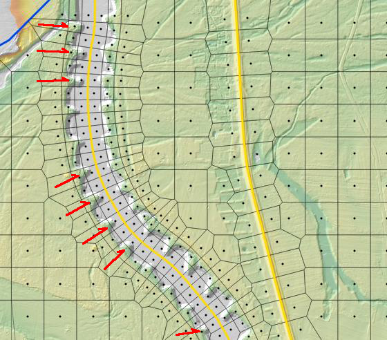
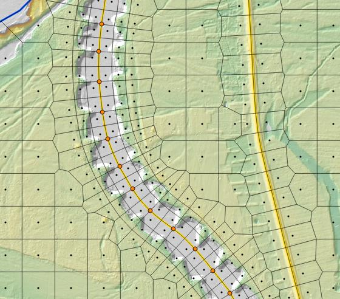

.. _stepbystep2d:

=================================
Step by step: HEC-RAS 2D Geometry
=================================

Required data: 

1. Flow area(s) shape --- a polygon layer with a name and a mesh spacing attributes.

2. DTM, digital terrain model --- a raster layer.

Optional data:

3. Structure lines --- a polyline layer. You only need it, when 2D mesh should be aligned to a flow controlling structure like a levee or embankment.

4. Structure breakpoints --- a point layer. By default the mesh cell size at structures is given by attributes of a structure line. If you need a variable mesh spacing or a cell face placed exactly at a location, you need breakpoints.

5. Land cover --- a polygon layer. HEC-RAS will use it to calculate mesh cells roughness.

------------------------------------------------------
Step 0. Install QGIS, PostGIS and the RiverGIS plugin
------------------------------------------------------

.. note::

    This short subsection is Windows oriented, as most of the HEC-RAS users use this operating system. However, installing QGIS and PostGIS on GNU/Linux systems is not only possible, but much easier. 
    
1. If you need to install PostGIS, please refer to `Windows download section of PostGIS website <http://postgis.net/windows_downloads>`_.

2. Install QGIS with **32-bit** `OSGeo4W installer <http://download.osgeo.org/osgeo4w/osgeo4w-setup-x86.exe>`_. For a 64-bit version Windows users can face a difficulty installing extra Python packages needed by the RiverGIS. Use the 'Advanced' type of installation and from the list of packages select :menuselection:`Desktop --> qgis`. This will install current stable version of QGIS and all other required packages.

3. Install RiverGIS plugin: :menuselection:`Plugins --> Manage and install plugins...`. Search for :file:`RiverGIS` and click :command:`Install` button.

---------------------------------------------------------
Step 1. Create/load required data
---------------------------------------------------------
.. note::

  QGIS User Manual `Loading raster data <http://docs.qgis.org/2.8/en/docs/user_manual/working_with_raster/supported_data.html>`_ and `Loading vector data in QGIS <http://docs.qgis.org/2.8/en/docs/user_manual/working_with_vector/supported_data.html>`_ is an excellent start point for QGIS beginners.
  
1. **Start from saving QGIS project** in a favourite directory :menuselection:`Project --> Save` 
2. **Load a raster of digital terrain model (DTM)**\ . Below you can see a DTM with a hillshade as an overlay (`see QGIS Training Manual  <http://docs.qgis.org/2.8/en/docs/training_manual/rasters/terrain_analysis.html?highlight=hillshade>`_).

  .. _fig_sbs_loadDtm:
  .. figure:: img/sbs02.png
     :align: center
     
     DTM and hillshade overlay loaded into QGIS project

3. **Create a 2D Flow Areas** polygon layer (:menuselection:`Layer --> Create Layer --> New Shapefile Layer...`) with required fields:

  * name of 2D Flow Area (text) and
  * cell size (whole number) --- a default mesh points spacing in layer's CRS units.
  
  The layer's :abbr:`CRS (Coordinate Reference System)` should be identical with DTM's CRS. See `QGIS Training Manual <http://docs.qgis.org/2.8/en/docs/training_manual/create_vector_data/create_new_vector.html#basic-fa-the-layer-creation-dialog>`_ for creating vector layer details. Finally, **change the layer's rendering style** by double clicking the layer in the legend tree (`ref <http://docs.qgis.org/2.8/en/docs/user_manual/working_with_vector/vector_properties.html#style-menu>`_).

  .. _fig_sbs_create2dFlowAreaLayer:
  .. figure:: img/sbs03.png
     :align: center
     
     Create 2D Flow Areas polygon layer
  

4. **Create structure lines layer** with required fields:
 
  * cellsizesx (whole number) --- a default mesh points spacing along the structure
  * cellsizesy (whole number) --- a default mesh points spacing across the structure
  * mesh rows (whole number) --- a number of mesh rows that should be aligned to the structure
  
  Again, the layer's :abbr:`CRS (Coordinate Refernece System)` should be identical with DTM's CRS. **Change the layer's rendering style** by double clicking the layer in the legend tree.
  
  .. _fig_sbs_createStructureLinesLayer:
  .. figure:: img/sbs04.png
     :align: center
     
     Create structure lines layer

 
5. **Digitize 2D Flow Area**\ . 

  .. note:: 
       `QGIS User Manual <http://docs.qgis.org/2.8/en/docs/user_manual/working_with_vector/editing_geometry_attributes.html>`_ has extensive part on vector layers editing.
   
  In the legend window select the 2D flow areas layer and toggle editing mode by clicking |toggle_editting| button, then |capture_polygon| and **capture your 2D flow area polygon** clicking on its vertices. Finish drawing with right click. 
  
  .. |toggle_editting| image:: img/mActionToggleEditing.png
  .. |capture_polygon| image:: img/mActionCapturePolygon.png
  .. |capture_line| image:: img/mActionCaptureLine.png
  
  .. _fig_sbs_create2dareaPolygon:
  .. figure:: img/sbs05.png
     :align: center
     
     Digitize 2D flow area polygon
   
  Depending on your QGIS setup, you can have attribute form displayed right after digitizing or you will have to open layer's attribute table to **define the attributes**\ . 
  
  .. _fig_sbs_create2dareaAttributes:
  .. figure:: img/sbs06.png
     :align: center
     
     Define 2D flow area attributes
  
  After the attributes are defined toggle the editing mode with |toggle_editting| button and save the changes. Now we have complete 2d flow area shape with the name 'My First Area' and the default mesh points spacing 100 meters.
  
6. **Digitize structure lines**\ . 

  In the legend window select the structure lines layer and toggle edit mode, then click |capture_line| button and start capture a structure line by clicking its vertices. In this example we would like to have two structures defined:
  
  * **levee** on the right side of the main channel: we don't want the flow to go through the levee, so we have to align cell faces to the levee centerline. Please, refer to the HEC-RAS 5.0 documentation on creating 2d flow areas for detailed explanation. We would like the mesh spacing be a little bit finer 
  * **the main channel** itself: having 100 meters mesh spacing on floodplain is fine, but for the main channel we would like to have much finer cells, say 40 meters. The channel is wider than 40 meters, so we would need to align a few rows of the mesh to the river centerline --- let's check 3 rows.

 Note: structure lines should be placed inside the 2d area and not touch its boundary.

  .. _fig_sbs_create2dareaStuctureLines:
  .. figure:: img/sbs07.png
     :align: center
     
     Digitize structure line
  
  Fill in the attributes:
  
  .. _fig_sbs_createStructureLineAttributes:
  .. figure:: img/sbs08.jpg
     :align: center
     
     Define structure lines attributes

.. note::
  
   `Download the above vector layers from rivergis.com <http://rivergis.com/tut_create_2g_geom_lyrs.7z>`_
   
---------------------------------------------------------
Step 2. Create 2D Flow Area
---------------------------------------------------------

1. **Select PostGIS connection and schema**
   
  Open RiverGIS plugin main window. Creating the mesh requires an active connection to a PostGIS database. Please refer to `QGIS User Manual for creating PostGIS connection description <http://docs.qgis.org/2.8/en/docs/user_manual/working_with_vector/supported_data.html#creating-a-stored-connection>`_.

  .. _fig_sbs_rivergisConnSchemaSelected:
  .. figure:: img/sbs10.png
     :align: center
     
     RiverGIS plugin main window and connection/schema selection
     
  After you have defined a connection, you should be able to select it in the Connections tree of the RiverGIS. Every newly created PostgreSQL database has a public schema, which we can use for storing our data, but it is advisable to create a new schema for each case. We would like to **create a new schema** 'my_first_2d_geom' and we do this in DB Manager plugin (:menuselection:`Schema --> Create schema`). 
  
2. **Create the model geometry**

  Having the connection and schema selected we can create the geometry from the RiverGIS menu :menuselection:`2D Geometry --> Create 2D Flow Areas`. Set the parameters of the tool and click :command:`OK` button. 
  
  .. _fig_sbs_create2dFlowAreaParams:
  .. figure:: img/sbs09.png
     :align: center
     
     Create 2D Flow Area parameters dialog window
     
3. **Preview the mesh**

  If the 2D flow area creation was successful, we should be able to preview the mesh. First, let's try to **load the mesh points to QGIS**\ : expand the schema in the Connections tree, right click the :file:`mesh_pts` database table and add it to the map canvas. 
  
  .. _fig_sbs_addMeshPtsToCanvas:
  .. figure:: img/sbs11.png
     :align: center
     
     Add mesh points to the map canvas
     
  .. _fig_sbs_MeshPtsAddedToCanvas:
  .. figure:: img/sbs13.png
     :align: center
     
     Mesh points added to the map canvas
  
---------------------------------------------------------
Step 3. Import the geometry to HEC-RAS
---------------------------------------------------------

1. To **preview the geometry in HEC-RAS**, from the main HEC-RAS window run :menuselection:`File --> Import HEC-RAS data...` and choose the geometry created by RiverGIS.
 
  .. _fig_sbs_previewMeshGeometry:
  .. figure:: img/sbs12.png
     :align: center
     
     Preview 2D Flow Area in HEC-RAS Geometry Data editor
     
2. **Preview the mesh in RAS Mapper**
  
  .. _fig_sbs_previewMeshRASMapper:
  .. figure:: img/sbs14.png
     :align: center
     
     Preview 2D Flow Area mesh in RAS Mapper
     
---------------------------------------------------------
Step 4. Check the mesh
---------------------------------------------------------

Let's have a closer look at the generated mesh.

.. _fig_sbs_checkMesh:

   
   Details of the generated mesh

What we would like to change in the mesh:

* Some groins miss a cell face (red arrows) --- cell faces are placed at equal distance, but groins are not. We need a variable mesh spacing. We will achieve this by constructing **breakpoints** at which a cell face is required.
* Decrease a little bit the mesh spacing at the right levee.

This will result in the following: 

.. _fig_sbs_checkedMesh:

   
   Main channel mesh aligned with breakpoints (orange points)

