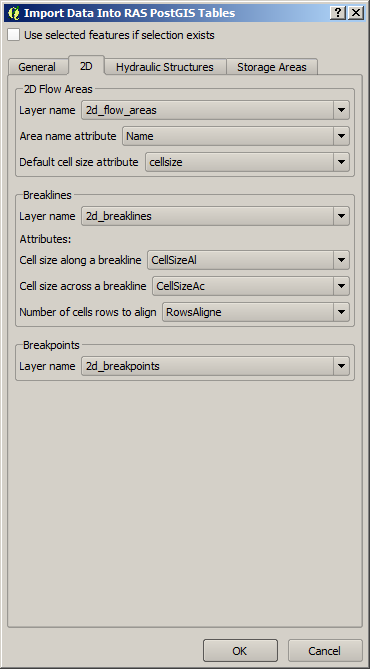
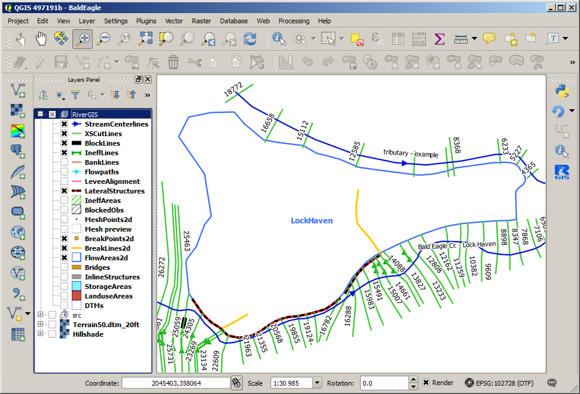
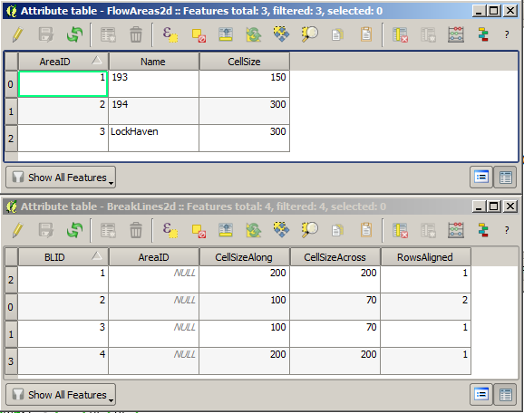
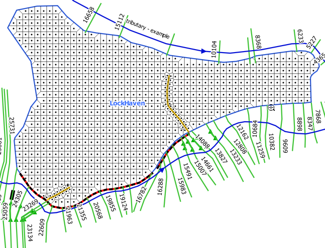
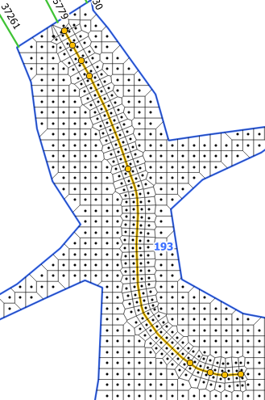

.. _hecras2d:

===================
HEC-RAS 2D Geometry
===================

This manual presents creating HEC-RAS 2D Flow Areas in RiverGIS plugin. For 1D geometry and how to start working with RiverGIS, refer to :ref:`previous section <stepbystep1d>`.

2D flow functionality is introduced in HEC-RAS version 5.0. Users are strongly encouraged to read the `2D Modeling with HEC-RAS 5.0`_. Also `The RAS Solution Blog <http://hecrasmodel.blogspot.com/>`_ is a great source of information about new HEC-RAS releases and 2D modeling.

  .. _2D Modeling with HEC-RAS 5.0: http://rivergis.com/docs/2D_Modeling_with_HEC_RAS_50.pdf

RiverGIS builds 2D HEC-RAS geometry using following river database tables created by a user:

1. ``FlowAreas2D`` (required) --- a polygon layer representing 2D Flow Areas. It has 2 user defined attributes:
  * ``Name`` --- 2D Flow Area name
  * ``CellSize`` --- a default mesh cell size for a flow area.

2. ``BreakLines2D`` (optional) --- a polyline layer for aligning cell faces along the breaklines with 3 user defined attributes:
  * ``CellSizeAlong`` --- default mesh points spacing along a structure
  * ``CellSizeAcross`` --- default mesh points spacing across a structure
  * ``RowsAligned`` --- number of mesh rows that should be aligned to a breakline

3. ``BreakPoints2D`` (optional) --- a point layer for creating a cell face at exact locations along the breaklines (optional). No attributes required.

4. ``DTM`` (required) --- a digital terrain raster layers set.

--------------------------
Importing 2D geometry data
--------------------------

Users can edit the tables with QGIS geometry editing tools or import geometries and attributes from another data source. Here, we will import spatial data for 2D flow objects from modified `Bald Eagle example data <http://rivergis.com/download/baldeagle.zip>`_ --- the same we used for :ref:`1D modeling section <stepbystep1d>`. In addition to 1D geometry objects we will use 2D tab of the import dialog to load 2D flow areas, breaklines and breakpoints:

All the target tables should be automatically added to the map canvas after the import. If they are not, use the |loadtables| tool to load all river database tables into QGIS project.

----------------------
Creating 1D base model
----------------------

First, :ref:`run all the 1D tools <stepbystep1d>` to build the base model for 2D flow areas.

----------------
Creating 2D mesh
----------------

Next, check the user defined attributes of the ``FlowAreas2D`` and ``BreakLines2D`` layers using their attributes table, as shown below.

Create 2D Computational Points
------------------------------

==============  =================================================================
|2dpts|         ``RAS Geometry`` > ``Create 2D Computational Points``
==============  =================================================================

  .. |2dpts| image:: img_ico/ras2dareaCreate.png

Creates computational points for each 2D flow area.

If the mesh has to be aligned to a structure, use breaklines (``BreakLines2D``):

If special locations of cell faces are needed, use breaklines with breakpoints:

The breakpoints are especially useful when modeling groins, as shown below.

.. figure:: img/ras2d_mesh_brkpts2.jpg
   :align: center

Preview 2D Mesh
---------------

==============  =================================================================
|preview_mesh|  ``RAS Geometry`` > ``Preview 2D Mesh``
==============  =================================================================

  .. |preview_mesh| image:: img_ico/ras2dareaPreview.png

Creates a preview of 2D mesh with QGIS Processing algorithm (Voronoi polygons).

Save 2D Points to HEC-RAS Geometry
----------------------------------

==============  =================================================================
|save_mesh|     ``RAS Geometry`` > ``Save 2D Points to HEC-RAS Geometry``
==============  =================================================================

  .. |save_mesh| image:: img_ico/ras2dareaSaveToGeo.png

Saves the mesh points to a chosen HEC-RAS Geometry file (\*.g\**). If the chosen file is an existing geometry, the 2D flow areas will be added to it. If the file doesn't exist, a new empty geometry will be created.

.. note::
    There is no documentation for 2D Flow Areas in *HEC-RAS GIS Import* file format (SDF). Therefore, the mesh points are written to a geometry file. Please, close the geometry file before writing to it.

