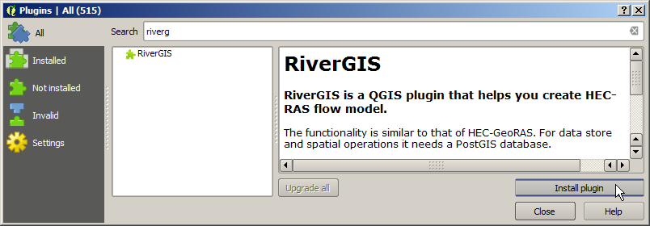
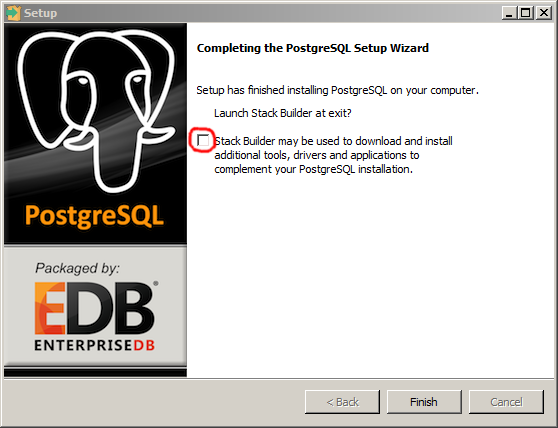
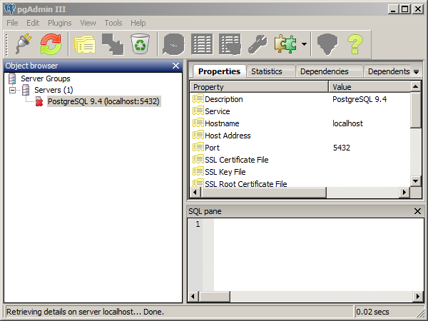
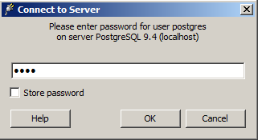
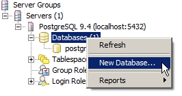
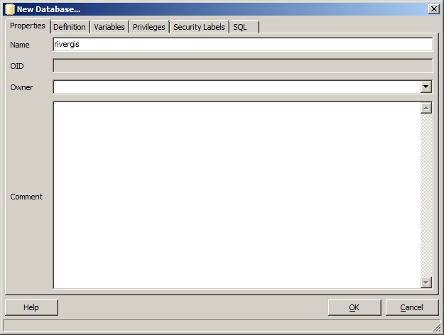
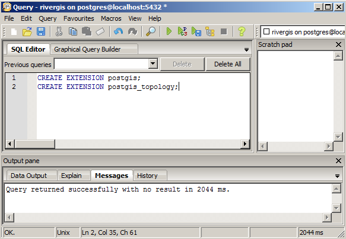
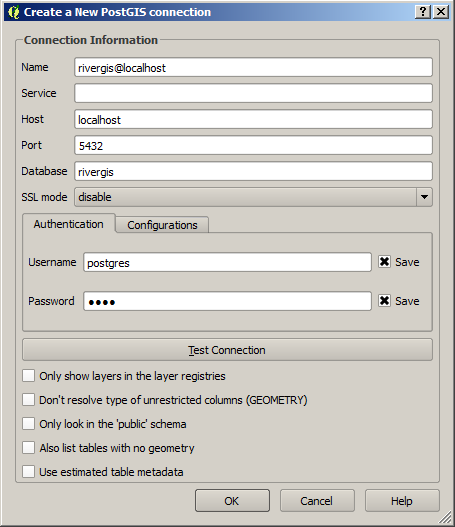

.. _requirements:

------------
Requirements
------------
QGIS LTR (2.8) is the minimum required QGIS version for RiverGIS 1.0.
RiverGIS can be installed from the plugin manager:

``Plugins`` > ``Manage and Install Plugins...``.

In the ``All`` tab search for *rivergis*, select it and click ``Install plugin`` button.

``RiverGIS`` needs a connection to ``PostgreSQL`` database with spatial extensions of ``PostGIS``.

PostGIS Installation
====================
``PostGIS`` is a spatial database extender for ``PostgreSQL`` database. ``PostgreSQL`` is released under the `PostgreSQL License <http://www.opensource.org/licenses/postgresql>`_, a liberal Open Source license, similar to the BSD or MIT licenses. ``PostGIS`` is released under the `GNU General Public License (GPLv2) <http://www.gnu.org/copyleft/gpl.html>`_.

The Database
------------
Download an installer that suits your needs from http://www.enterprisedb.com/products-services-training/pgdownload#windows. If you're on 64-bit Windows, we suggest stable (non-beta) Win-x86-64 installer. For a guidance visit `PostgreSQL installation wiki <https://wiki.postgresql.org/wiki/Running_%26_Installing_PostgreSQL_On_Native_Windows>`_.

During the installation you will be asked for database superuser (postgres) password -- remember it well. Choose the default port for connections (5432). In the end the installer offers a Stack Builder for installing additional tools. Please, skip it.

PostGIS
-------

Download appropriate ``PostGIS`` installer from ``PostGIS`` windows installers page http://download.osgeo.org/postgis/windows/. For ``PostgreSQL`` 9.4 64-bit you need `postgis-bundle-pg94x64-setup-2.2.0-1.exe <http://download.osgeo.org/postgis/windows/pg94/postgis-bundle-pg94x64-setup-2.2.0-1.exe>`_.

Run the installer and choose 'Yes' for all questions (set GDAL_DATA environment variable, enable raster drivers and out of db rasters).

PostgreSQL Configuration
========================

``RiverGIS`` requires a ``PostgreSQL`` database with ``PostGIS`` spatial extensions. ``PostgreSQL`` comes with ``pgAdmin``, a database management tool. We will use it to create spatial database for ``RiverGIS``.

Run ``pgAdmin`` and connect to server. If you have just installed ``PostgreSQL``, localhost:5432 is the only option.

Double-click on the server and enter the password you set during the installation.

Right-click on ``Databases`` and choose ``New Database``.

Enter a name and click OK. There are plenty of other options to set, but for now we choose defaults.

Open newly created database ``rivergis``. There is only one schema (public) in the database and it has only one extension (plpgsql). You can create new schemas here by right-clicking on the ``Schemas`` or create them later from ``RiverGIS`` GUI.

.. figure:: img/pgadmin05.png
   :align: center

Use |sqlbutton| to open SQL query editor and create ``PostGIS`` extensions for the database. Enter the following query and press ``F5``::

  CREATE EXTENSION postgis;
  CREATE EXTENSION postgis_topology;

In QGIS define a new database connection from ``Layer`` > ``Add layer`` > ``Add PostGIS Layers...``.

Pick ``New`` and fill in the connection details, for example:

In this case the database server is installed on the local mashine (localhost) and is working on the default port 5432. The database is ``rivergis`` and user is ``postgres`` --- a superuser with administrative rigths, that was created during the database installation. Check the connection using ``Test Connection``. If the connection was succesful, close the dialog by clicking ``OK``. If it fails to connect, check the connection details and try again.

