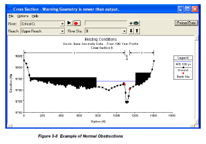
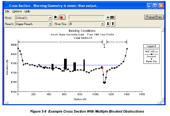

.. _typicalWorkflowRas1d:

--------------------------------------------------
Typical Workflow: Create 1d HEC-RAS Geometry Model
--------------------------------------------------

Utworzenie tabel i geometrii źródłowej
--------------------------------------

* Create empty river database tables for 1d HEC-RAS model or
* Import the model geometry from existing layers loaded into a QGIS project

Dalej będzie po polsku, bo to tylko dla nas:

Absolutnie konieczne jest włożenie geometrii do 2 tabel:

* ``RiverCenterlines`` (linestring) (a może zwyczajnie ``rivers``?)::

    ('"RiverId"', "serial primary key"), -- proponuję zastapić hydroid identyfikatorem rzeki
    ('"RiverCode"', "text"), -- wymagany z palca
    ('"ReachCode"', "text"), -- wymagany z palca
    ('"FromNode"', "integer"),
    ('"ToNode"', "integer"),
    ('"ReachLen"', "double precision"), -- długość odcinka
    ('"FromSta"', "double precision"), -- kilometraż początku: wymagany z palca
    ('"ToSta"', "double precision"), -- km końca: z palca
    ('"Notes"', "text")

* ``XsCutlines`` (linestring)::

    ('"XsecId"', "serial primary key"), -- proponuję zastapię hydroid identyfikatorem przekroju
    ('"RiverId"', "integer"),
    ('"Station"', "double precision"), -- kilometraż przekroju
    ('"LeftBank"', "double precision"),
    ('"RightBank"', "double precision"),
    ('"LeftLen"', "double precision"),
    ('"ChanLen"', "double precision"),
    ('"RightLen"', "double precision"),
    ('"Name"', "text"),
    ('"Description"', "text")

Inne dane są opcjonalne.

Topologia sieci
---------------

* wypełnienie tabeli ``NodesTable``, punktów początku (FromNode) i końca rzeki (ToNode) z nadanym identyfikatorem
* nadać stacje początkom i końcom odcinków rzek --- należy przypomnieć użytkownikowi, że trzeba to zrobić z palca?

Tabela ``NodesTable`` (point)::

    ('"NodeId"', "serial primary key"),
    ('"X"', "double precision"), -- wspólrzędna geodezyjna x
    ('"Y"', "double precision") -- wspólrzędna geodezyjna y

.. _workflowRas1d_xsections:

Podstawowe dane przekrojów poprzecznych
---------------------------------------

Następnie wypełniamy atrybuty tabeli ``XsCutlines``:

* ``RiverId`` poleceniem ``River/Reach Names`` --- z warunku przecięcia się linii rzeki z przekrojem
* ``Station`` poleceniem ``Stationing``::

    Station = FromSta + m * ReachLen

    gdzie:
    m = frakcja długości odcinka rzeki w punkcie przecięcia z XsCutline

* ``LeftBank``, ``RightBank`` poleceniem ``Bank Stations`` - znajdujemy punkty przecięcia XsCutline z  liniami brzegów i odczytujemy odpowiadające im frakcje odległości wzdłuż XsCutline. Tabela przebiegu linii brzegowych ``BankLines`` ma postać::

    ('"BankId"', 'serial primary key'), -- id brzegu
    ('"Type"', 'text'), -- typ brzegu: lewy lub prawy
    ('geom', 'geometry(Linestring,SRID)'), -- geometria

* ``LeftLen``, ``ChanLen``, ``RightLen`` poleceniem ``Downstream Reach Lengths``. Znaleźć ``XsecId`` przekroju poniżej. Obliczyć frakcje punktów przecięcia przekroju i odpowiednich linii przepływu i na ich podstawie obliczyć odległości między przekrojami. Tabela linii przepływu wzdłuż trzech części przekroju ma postać::

    ('"PathId"', 'serial primary key'), -- id linii przepływu
    ('"Type"', 'text'), -- część przekroju: 'L', 'R' lub 'Ch'
    ('geom', 'geometry(Linestring,SRID)'), -- geometria

.. _workflowRas1d_dem:

Próbkowanie DEM w przekroju
***************************

W `Issues pisałem <http://sr101537.imgw.ad:81/rpasiok/rgroup/issues/12>`_  o próbkowaniu DEMa wzdłuż przekroju i że jest to jedna z kosztowniejszych czasowo analiz, więc warto byłoby zachować jej wynik w tabeli. Zaproponowałem następującą strukturę::

    ('"PtId"', 'bigserial primary key'), -- id punktu
    ('"XsecId"', 'integer'), -- identyfikator przekroju, do którego punkt należy
    ('"Station"', 'double precision'), -- odległość punktu od początku przekroju [m]
    ('"Elevation"', 'double precision'), -- wysokość [mnpm]
    ('"CoverCode"', 'text'), -- kod pokrycia terenu
    ('"SrcId"', 'integer'), -- kod źródła danych (gid)
    ('"Notes"', 'text'), -- miejsce na inne uwagi
    ('"geom"', 'geometry(Point, SRID)') -- położenie punktu we współrzędnych geodezyjnych

Proponuję, aby gęstość próbkowania rastra DEM przyjąć jako równą rozdzielczości DEM. Dla dużych rzek będziemy mieli wówczas mnóstwo punktów w każdym przekroju i należałoby pomyśleć o odfiltrowaniu punktów nieznaczących (zob. `Issues <http://sr101537.imgw.ad:81/rpasiok/rgroup/issues/16>`_). Jest kwestia, kiedy to robić. Ja skłaniam się do tego, aby robić to od razu po próbkowaniu DEMa, ale wiąże się z tym kilka dalszych spraw.

Sprawdziłem możliwości importu do HEC-RAS większej ilości punktów niż 500. Próba się powiodła i jest możliwość filtrowania przekrojów później w samych HEC-RASie. Możemy się zastanowić, czy chcemy wyposażyć wtyczkę w filtrowanie czy nie.

Jeśli będziemy filtrować, to po odfiltrowaniu punktów nieznaczących może się okazać, że wyleciał nam np. punkt brzegu. Nie wszystkie elementy przekroju muszą byc przypisane do konkretnego istniejącego punktu przekroju, ale brzegi akurat muszą (w Mike'u jest podobnie: marker stawiamy w punkcie przekroju). Poza tym, użytkownik zawsze może zmienić położenie linii brzegu po wykonaniu innych analiz i wówczas **musimy mieć możliwość dołożenia do przekroju punktu w określonym x (Station) - jego wysokość byłaby interpolowana na podstawie sąsiadów**.

Oto tabela danych przekroju z informacją, czy muszą być umieszczone w istniejącym punkcie:

==================      ==============      ==================
rodzaj danych           HEC-RAS wymaga      Mike wymaga
==================      ==============      ==================
brzeg/marker 4 i 5      tak                 tak
wał/marker 1 i 3        nie                 tak
zmiana Manninga         tak                 tak
pole jałowe             nie                 brak odpowiednika
przeszkoda              nie                 brak odpowiednika
==================      ==============      ==================

Inne opcjonalne dane przekrojów
-------------------------------

.. _workflowRas1d_blocked:

Blocked Obstructions
********************

Przeszkody wprowadzamy w postaci poligonów z atrybutem wysokości::

    ('"BlockId"', 'serial primary key'),
    ('"Elevation"', 'double precision'),
    ('"Notes"', 'text') -- może to być nazwa lub opis przeszkody

Mamy dwa typy przeszkód:

* normalne: podajemy strone po której znajduje się przeszkoda, do (od) jakiej odległości x przekrój jest zablokowany i do jakiej wysokości (górny rysunek)
* multiple: podajemy dowolną ilość bloków opisanych: xstart, xend i wysokość (dolny rysunek)

W HEC-GeoRAS przeszkody zapisywane są jako typ multiple --- z punktu widzenia solvera, typ pola nie ma znaczenia, a nie ma co niepotrzebnie komplikować narzędzia, aby rozpoznawało, z jakim typem pola ma do czynienia --- multiple jest ok.

Proponuję przecinać poligony przeszkód przekrojami i wypełniać następującą tabelę ``BlockedPositions`` (bez geometrii)::

    ('"id"', "serial primary key"),
    ('"XsecId"', "integer"), -- którego przekroju dotyczy
    ('"BegFrac"', "double precision"), -- frakcja długosci przekroju dla początku przeszkody
    ('"EndFrac"', "double precision"), -- frakcja końca przeszkody
    ('"Elevation"', "double precision"), -- wysokość przeszkody (rzędna npm)

.. _workflowRas1d_ineffective:

Ineffective Flow Areas
**********************

Pola jałowego przepływu wprowadzamy w postaci poligonów z atrybutem wysokości::

    ('"IneffId"', 'serial primary key'),
    ('"Elevation"', 'double precision'),
    ('"Notes"', 'text') -- może to być nazwa lub opis pola

Podobnie jak w przypadku blocked obstructions mamy dwa typy pól jałowego przepływu, czyli takich obszarów, które są zalewane, ale prędkość przepływu wzdłuż głównego kierunku przepływu jest zbliżona do zera:

* normalne: podajemy strone po której znajduje się pole jałowe, do (od) jakiej odległości x przekrój jest jałowy i do jakiej wysokości
* multiple: podajemy dowolną ilość bloków opisanych: xstart, xend i wysokość

Tabela pól jałowych ``IneffectivePositions`` (bez geometrii)::

    ('"id"', "serial primary key"),
    ('"XsecId"', "integer"), -- którego przekroju dotyczy
    ('"BegFrac"', "double precision"), -- frakcja długosci przekroju dla początku pola
    ('"EndFrac"', "double precision"), -- frakcja końca pola
    ('"Elevation"', "double precision"), -- wysokość pola (rzędna npm)

Tabelę tę wypełniamy sprawdzając przecięcia przekrojów i pól jałowych.

.. _workflowRas1d_levees:

Wały
****

Tabela wałów ``LeveePositions`` (bez geometrii)::

    ('"LeveeId"', "serial primary key"),
    ('"XsecId"', "integer"), -- którego przekroju dotyczy
    ('"Fraction"', "double precision"), -- frakcja długosci przekroju dla początku pola
    ('"Elevation"', "double precision"), -- wysokość wału

Tabelę wypałniamy znajdując punkty przecięcia linii wałów z przekrojami. Można się zastanowić, czy warto zapisywać w osobnej tabeli punkty wałów (LeveePoints). Moim zdaniem nie ma takiej potrzeby.

.. _workflowRas1d_manning:

Manning's n
***********

Tabela zmian użytkowania i szorstkości ``Manning`` (bez geometrii)::

    ('"id"', "serial primary key"),
    ('"XsecId"', "integer"), -- którego przekroju dotyczy
    ('"Fraction"', "double precision"), -- frakcja długosci przekroju dla początku pola
    ('"N_Value"', "double precision"), -- współczynnik Manninga

Uwaga na marginesie: Szkoda, że nie możemy przekazać do HEC-RAS (ani do Mike'a) informacji o samym pokryciu i dopiero tam przypisać danemu pokryciu wpsółczynnik szorstkości. Może coś zmieni się w przyszłości, ale teraz do obu programów obliczeniowych wprowadzamy konkretne wartości wsp. Manninga *n* (lub Stricklera *M* w Mike'u).

